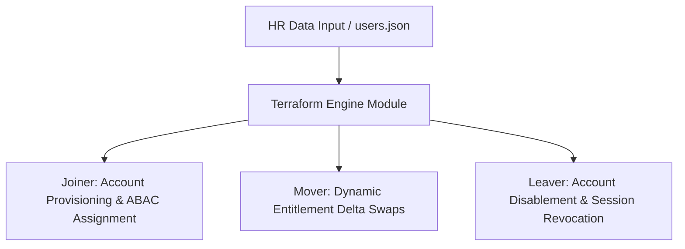

# Enterprise Identity-as-Code (JML) Engine

An automated Joiner-Mover-Leaver (JML) identity provisioning and governance engine built with Terraform, HCL delta calculations, and GitHub Actions pipelines.

## System Architecture



## Key Features

- **Declarative Lifecycle Management:** Eliminates manual administrative overhead. User onboarding, department changes, and offboarding are processed entirely via code changes.
- **Entitlement Creep Prevention:** Uses HCL state tracking loops to evaluate department attributes. It instantly revokes legacy access security groups when an employee moves teams.
- **Automated Offboarding:** Terminated identities are instantly shifted to `account_enabled = false`, stripped of active group memberships, and targeted for live session token invalidation.
- **CI/CD Security Guardrails:** Every code change triggers automated linting, schema validation, and static security scanning (`tfsec` / `tflint`) via integrated GitHub Actions pipelines.

## Getting Started

```bash
# Clone the repository
git clone https://github.com/mikeiam1004/iam-joiner-engine.git
cd iam-joiner-engine

# Initialize and plan configuration locally
terraform init
terraform plan
```
