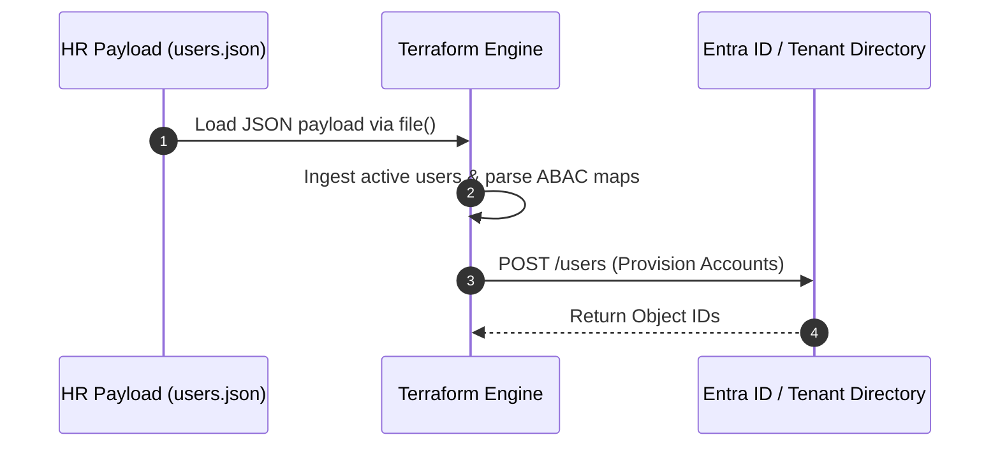

# Runtime Identity Sequence

```mermaid
sequenceDiagram
    autonumber
    participant HR as HR Payload (users.json)
    participant TF as Terraform Engine
    participant IDP as Entra ID / Tenant Directory

    HR->>TF: Load JSON payload via file()
    TF->>TF: Ingest active users & parse ABAC maps
    TF->>IDP: POST /users (Provision Accounts)
    IDP-->>TF: Return Object IDs
```
