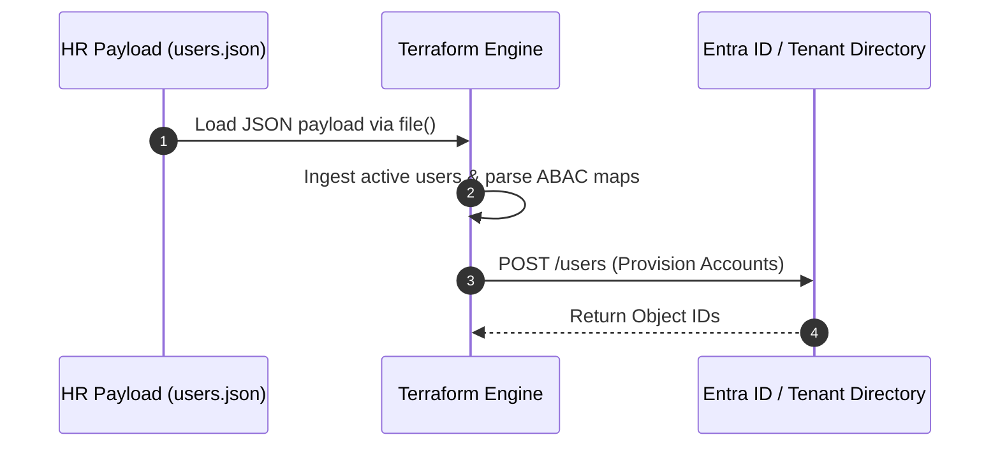
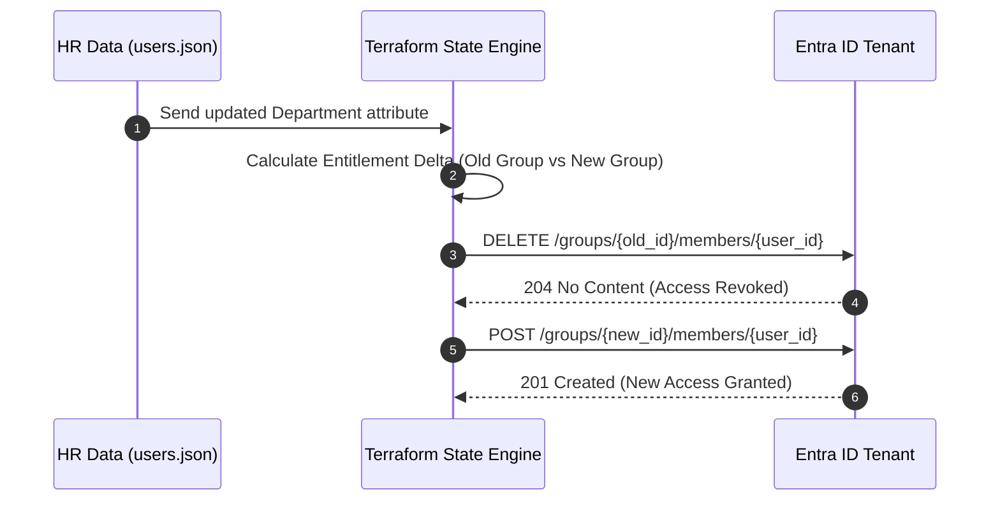

# Runtime Identity Sequence

---

## Mover State Transition Workflow

When an employee changes departments (a "Mover" event), the engine calculates the differences between their old entitlements and new requirements, executing the lifecycle changes below:

## Entitlement Delta Strategy & Permission Creep Mitigation

In traditional identity management, when an employee shifts from **Finance** to **Engineering**, they are often added to the Engineering group while their old Finance memberships are forgotten. This accumulates over time as **permission creep**—a major security compliance risk.

Terraform completely eliminates permission creep through **Declarative State Management**:
* **The Desired State Blueprint**: Terraform doesn't look at individual actions; it checks the complete picture. When the department changes to `Engineering`, the *only* target state defined for that user key is membership in the Engineering group.
* **Automatic Eviction (The Delta)**: Because the user's mapping to the Finance group is no longer present in the code, Terraform detects a discrepancy with the live environment. 
* **Atomic Cleanups**: During execution, Terraform isolates this delta and fires an atomic `DELETE` command to tear down the old access right *before or alongside* granting the new one. No stale permissions are ever left behind.
